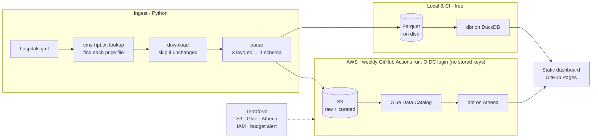

# What does care cost in Massachusetts?

A pipeline that collects hospital price transparency files, models them with dbt, and publishes a dashboard comparing what insurers pay for the same service at different hospitals.

**Live dashboard:** https://ahmedfhakim.github.io/ma-hospital-prices/

## Why this data

Since 2021, federal rules (45 CFR 180) require every U.S. hospital to publish a machine-readable file of its prices: list prices, cash prices, and the rate negotiated with **each insurer and plan**. The 2026 update added what hospitals were **actually paid** (median, 10th and 90th percentile allowed amounts). The data is public, but it's hard to use:

- Hospitals publish in three different layouts (tall CSV, wide CSV, JSON), across schema versions
- Files range from megabytes to many gigabytes
- Every hospital spells insurers differently ("BCBS MA", "Blue Cross Blue Shield of Massachusetts", "BLUE CROSS - HMO BLUE")
- Some rates are dollars, some are "% of billed charges"

## Architecture

The same code runs in two places. Locally and in CI it uses DuckDB, which is free and needs no account. In production it runs weekly on AWS.



| Layer | Tool | What it does |
|---|---|---|
| **Discover** | `ingest/discover.py` | Reads each hospital system's `cms-hpt.txt` index to find the current price file |
| **Download** | `ingest/download.py` | Streams to disk. Skips unchanged files (ETag / Last-Modified, then SHA-256). Unzips if needed |
| **Parse** | `ingest/parse.py` | Tall CSV, wide CSV and JSON → one standard long table. DuckDB for CSV, streaming `ijson` for JSON, so multi-GB files never load into memory. Fixes Windows-1252 encoding |
| **Publish to AWS** | `ingest/cloud.py` | Uploads raw files and Parquet to S3 (skipping unchanged content), then registers each hospital's partition with Athena |
| **Model** | dbt: DuckDB **or** Athena | Staging → billing codes and payer normalization → star schema → dashboard marts. One set of models; the few dialect differences live in `macros/cross_db.sql` |
| **Infrastructure** | Terraform (`infra/`) | S3 bucket, Glue tables, Athena workgroup with a per-query scan limit, $5 budget alert, and a keyless (OIDC) role for GitHub Actions |
| **Dashboard** | `dashboard/build.py` | Bakes the marts, from either engine, into one static HTML page. No server, no BI license |
| **Automation** | GitHub Actions | `ci.yml`: tests + full demo pipeline on every push. `aws-pipeline.yml`: weekly production run on AWS. `pages.yml`: publishes the dashboard |

### dbt models

```
staging/        stg_hpt__charges, stg_hpt__hospitals
intermediate/   int_charges__billing_code   pick the CPT/HCPCS/MS-DRG code; convert %-of-charges rates to dollars
                int_payers__normalized      raw payer names → carrier (seed patterns) + product line
marts/          dim_hospital, dim_payer, dim_service
                fct_negotiated_rates        grain: hospital × item × setting × modifiers × payer × plan
                mart_service_prices         service × hospital × carrier × product line (feeds the dashboard)
                mart_price_dispersion       per service: highest ÷ lowest hospital commercial median
```

**Data quality tests:** keys, relationships and accepted values, plus warnings built for this data:
- `warn_rate_above_gross_charge`: negotiated rate above the hospital's own list price (usually a unit error)
- `warn_hospital_service_coverage`: a hospital matches under half the target services (usually a parsing problem)
- `warn_unmapped_payers`: payer names no pattern recognizes. Add them to `seeds/payer_patterns.csv`
- Duplicate-rate check on the fact table set to **warn**: real files contain duplicates worth reviewing, not hiding

## Run it

```bash
make setup && source .venv/bin/activate

make test        # parser tests against CMS's official example files, plus mocked-AWS publish tests
make demo        # whole pipeline on 3 fictional hospitals, ~10 seconds
open dashboard/site/index.html

make discover    # check the real hospitals' file URLs
make all         # download → parse → dbt build → dashboard, with real data
```

To add a hospital, add an entry to `hospitals.yml` and run `make all`. Only new or changed files are re-downloaded.

**On AWS:** see [`infra/README.md`](infra/README.md) for the one-time setup (about 30 minutes). After that:
```bash
python -m ingest publish                                                  # S3 + Athena partitions
cd transform && dbt build --profiles-dir . --target athena --full-refresh  # models + tests in Athena
python dashboard/build.py --source athena
```

## What real files taught us

Boston Medical Center's file (March 2026, schema v3.0.0): 483 MB, 1.33 million rows, tall CSV. Every row parsed in about 15 seconds. The first run also exposed problems that the CMS examples and demo data couldn't:

| Found | Fix |
|---|---|
| 21 rows with an unescaped inch mark inside a quoted field (`"...ORNG 9"X 1"`) crashed the CSV parser | `prepare_csv` escapes stray quotes before parsing and **counts** them in the file metadata (`repaired_quote_lines: 21`) so the fix is visible, not silent. Regression test added |
| `payer_name` is the insurer **product** ("AARP UHC MEDICARE COMPLETE [1203]"), `plan_name` is the hospital's **contract** ("BMC HB MEDICARE - NO IME"). One contract serves several insurers | Match on the insurer name first, fall back to the contract name. Strip `[1234]` payer IDs |
| Payers prefixed `ZZZ` are retired in the billing system | Flagged `is_retired_payer`, excluded from dashboard marts |
| Traditional Medicare, Medicaid fee-for-service, TRICARE/VA, correctional health, PACE, Health Safety Net and workers' comp all appear | Six insurance types instead of three. Product-line overrides live in `seeds/payer_patterns.csv` |
| 88,217 "duplicate" rates: the same drug from different manufacturers (NDC) has different rates | Fact grain now includes every code on the item (`code_signature`). 26 true duplicates remain in the source file and are reported by a warn-level test |
| 124,045 "rate above list price" warnings: 95% were per-diem and case rates, which cover a whole day or stay | Test now compares fee-schedule rates only (7,040 remain: real observations) |
| No inpatient rows and no MS-DRG codes anywhere in the file | BMC doesn't publish DRG-level prices, so inpatient services can't be compared for this hospital |
| ECG under CPT 93000 never matched | Hospitals bill 93005 (tracing only); the physician bills the interpretation. Service list corrected |

**Mass General** (tall CSV, 159k rows) and **Beth Israel Deaconess** (JSON, 106k rows) added more:

| Found | Fix |
|---|---|
| BIDMC's web server only supports TLS "legacy renegotiation", which modern Python refuses | Opt-in `legacy_tls: true` per hospital in `hospitals.yml`. Certificates are still verified. Test proves the exception is scoped |
| BIDMC labels CPT codes as "HCPCS" (technically right: CPT is HCPCS Level I). Only 3 of 31 services matched | Classify by code format, not label: 5 digits (or 4 + letter) = CPT. Coverage went from 3 to 31 |
| BIDMC puts list and cash prices on chargemaster lines and negotiated rates on separate items that share only the CPT code | List-price lookup falls back from same item → same item, any setting → same billing code. `list_price_match` records which one was used |
| New payer types: MultiPlan/PHCS rental networks, international patients, transplant "centers of excellence", US Family Health Plan, Medex (Blue Cross's Medigap), Optum administering VA community care | Added to `payer_patterns.csv`. Contract names mentioning VA/TRICARE override to "Other government" |
| BIDMC lists some payer/plan/service combinations 2–3 times with different prices and nothing to tell them apart | Left as-is and reported by the duplicate test. The dashboard's median absorbs it |
| 28k BIDMC rates are formulas only (e.g. "% of Medicare"), with no dollar amount | Excluded from price comparisons for now (roadmap: parse the formulas) |
| First GitHub Actions run was denied by AWS. CloudTrail showed GitHub sending its newer OIDC subject with immutable IDs (`repo:owner@<id>/repo@<id>:...`) | IAM trust policy pins the repo's permanent numeric ID, so a deleted-and-recreated repo with the same name can't inherit access |
| BIDMC publishes no traditional Medicare rate | "% of Medicare" is blank for BIDMC (roadmap: benchmark against CMS fee schedules instead) |

**Validation against the contracts themselves.** BMC's contract names state their terms, and the model reproduces them exactly: "FALLON COMMERCIAL (130% OF MEDICARE)" computes to 130% of BMC's Medicare rate, and "SENIOR WHOLE HEALTH (120% OF MEDICARE)" to 120%.

**Across the three hospitals (commercial insurance, median across insurers):** Mass General is the most expensive for most outpatient services and BMC the least. Lab tests differ the most: a basic metabolic panel costs $16 at BMC and $108 at MGH (6.6×). Imaging differs by about 2× (brain MRI with and without contrast: $855 vs. $1,826). For surgery, Beth Israel is highest (knee arthroscopy, cataract, hernia repair, joint replacement).

**Contract type matters at a single hospital.** For the same brain MRI at BMC, commercial contracts paid as a percentage of the list price come out around $2,245, while fee-schedule contracts pay around $516, about 4× less. The cash price ($2,066) is higher than most insurers' negotiated rates.

## Design decisions

- **DuckDB + Parquet instead of a cloud warehouse.** The data fits on a laptop, costs nothing, and never expires. Moving to BigQuery or Snowflake means changing the dbt profile and pointing the sources at cloud storage.
- **One standard layout at ingestion.** Tall, wide and JSON differ only in shape, so the parser removes that difference and dbt never needs to know which layout a hospital used. The test suite proves it: CMS's example hospital parses to identical rates from all three layouts.
- **Payer matching in a seed, not in SQL.** The mapping is data that non-engineers can review and extend. Priority numbers settle overlaps (e.g. "Mass General Brigham Health Plan" wins over other patterns).
- **Percentage rates converted, but flagged.** "60% of billed charges" becomes 0.6 × the list price, with `rate_source` recording that it was derived.
- **One dbt project, two engines.** DuckDB costs nothing and needs no account, so CI and anyone cloning the repo can run everything. Athena is the production engine. Most SQL is written to run on both; the rest (arrays, regex, median, date parsing) goes through small dispatch macros. Rewriting the SQL to be portable changed no results on DuckDB: all 1.56M rates, 1,212 dashboard rows and 202 payer mappings came out identical. On Athena the fact table and payer mappings match exactly too; the one known difference is that Athena has no exact median, so medians use `approx_percentile` (a few list prices shift slightly; e.g. 9,761 vs. 9,767 rate-above-list-price warnings).
- **Serverless on AWS: S3 + Athena, no warehouse to keep running.** At this data size, a weekly run costs cents a month. 
- **No AWS keys in GitHub.** The weekly job gets temporary credentials through OIDC, for a role that only trusts this repo's `main` branch and can only touch this project's bucket, workgroup and Glue databases.
- **Static dashboard.** The published page contains only aggregates and loads instantly. Rebuilding it is one command.

## Known limitations

- Modifier adjustments (e.g. "bilateral procedure: 150%") are skipped. They adjust other rates rather than describe services.
- Negotiated rates are contract prices, not what a patient pays. Out-of-pocket cost depends on the plan's deductible and coinsurance.
- Hospital compliance varies. Files that fail to parse are logged in `data/manifest.json`, and the rest of the run continues.
- `seeds/shoppable_services.csv` is a curated subset of common services, not CMS's complete shoppable services list.

## Roadmap

- [x] **Milestone 1:** ingestion for all CMS layouts, dbt models + tests, dashboard, CI. Three real hospitals (BMC, MGH, BIDMC)
- [ ] **Milestone 2:** validate files against the CMS JSON schema and quarantine failures. Track file versions over time
- [x] **Milestone 3 (AWS):** S3 + Glue + Athena, Terraform, keyless weekly GitHub Actions pipeline. Full cloud run (download → S3 → dbt on Athena → dashboard) in under 3 minutes
- [ ] **Next:** Docker image; Dagster for orchestration with per-hospital retries
- [ ] **Milestone 4:** every Massachusetts hospital. Compare negotiated rates with 2026 actual-paid amounts. Parse formula-only rates. Benchmark against CMS Medicare fee schedules

## Sources

- [CMS Hospital Price Transparency](https://www.cms.gov/priorities/key-initiatives/hospital-price-transparency)
- [CMS templates, schema and example files](https://github.com/CMSgov/hospital-price-transparency). The files in `tests/fixtures/cms_example_*` come from here
